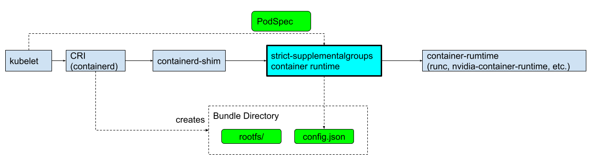

# strict-supplementalgroups-container-runtime <!-- omit in toc -->

This is a low-level container runtime implementation that enforces [`process.user.additionalGids`](https://github.com/opencontainers/runtime-spec/blob/main/config.md#user) in OCI runtime spec(`config.json`) passed from container-shim with the Pod's `Spec.SecurityContext.{SupplementalGroups ∪ FsGroup}`.

This works as a thin wrapper of existing low-level container runtime. This modifies `process.user.additionalGids` as below diagram:



## Table of Contents <!-- omit in toc -->

- [Motivation](#motivation)
- [How This Works by Example](#how-this-works-by-example)
- [Getting Started](#getting-started)
- [Deploy](#deploy)
- [Development](#development)
- [License](#license)
- [Acknowledgments](#acknowledgments)

## Motivation

### Why this is needed <!-- omit in toc -->

TL;DR: `PodSecurityContext.SupplementalGroups` can be easily bypassed by crafting container images even when some policy engine enforces it by cluster administrators.

Detailed explanation follows.

Assume a multi-tenant kubernetes cluster with `hostPath` volumes below situations:

- Multi-tenant model is namespace based (namespace per tenant(user/group) model)
  - access to each namespace is controlled by RBAC
- PSP(or other policy engines) is enforced in each namespace (detail is described below)
- A `hostPath` volume (say `/mnt/hostpath`) is maintained in all the nodes by administrators
  - with permission `drwxr-xr-x nobody nogroup /mnt/hostpath`
  - the directory mounts an NFS volume that is shared by all the tenants, and uids/gids are managed by the cluster admin
  - any tenant CAN create a directory under this directory
- In each namespace below PSP is enforced by the cluster admins. below is an PSP for the namespace `user-alice` for user `alice`:
  ```yaml
  # All the pods with mounting /mnt/hostpath` in user-alice namespace
  # this policy expects any pods in user-alice can run only with:
  # $ id
  # uid=1000,gid=1000,groups=1000,60000(group-foo)
  ...
  runAsUser:
    ranges: { min: 1000, max: 1000 } # alice's uid
    rule: MustRunAs
  runAsGroup:
    ranges: { min: 1000, max: 1000 } # alice's gid
    rule: MustRunAs
  supplementalGroups:
    ranges: { min: 60000, max: 60000 } # alice only belongs to group-foo(gid=60000)
    rule: MustRunAs
  volumes: ["hostPath"]
  allowedHostPaths: [{ pathPrefix: /mnt/hostpath }]
  ```
- `/mnt/hostpath/bypassed-group-private` directory is created by a user in `bypassed-gropup(gid=50000)` group
  - with permission `drwxrws--- root 50000 bypassed-group-private`
  - i.e. this directory is expected fully private for `bypassed-group(gid=50000)` group members

When user `alice` creates a pod with a custom image like this:

- container image `bypassing-supplementalgroups-image`:
  ```Dockerfile
  FROM ubuntu:22.04
  # alice belongs to bypassed-group(gid=50000) in this image
  # NOTE: alice does NOT belong to the group in the cluster
  RUN groupadd -g 50000 bypassed-group \
    && useradd -m -u 1000 alice \
    && gpasswd -a alice bypassed-group
  ```
- Pod:
  ```yaml
  apiGroup: v1
  kind: Pod
  metadata: 
    namespace: user-alice
    name: bypassing-supplementalgroups-pod
  spec:
    securityContext:
      runAsUser: 1000
      runAsGroup: 1000
      supplementalGroups: [60000]
    volumes:
    - name: nfs
      hostPath:
        path: /mnt/hostpath
  containers:
  - image: bypassing-supplementalgroups-image # alice belongs to bypassed-group(gid=50000) in this image
  ```

Then, 

- `bypassing-supplementalgroups-pod` satisfies the PSP which is enforced by the cluster admin.
- However, processes in `bypassing-supplementalgroups-pod` pod can have below identity
  ```shell
  # NOTE: gid=50000 is NOT included in supplementalGroups but only in container image.
  $ id
  uid=1000, gid=1000, groups=1000,60000(group-foo),50000(bypassed-group)
  ```
- the process CAN get access to  `/mnt/hostpath/bypassed-group-private` which is not expected by PSP.

### Why this happens <!-- omit in toc -->

In kubernetes API, [`Pod.SecurityContext.SupplementalGroups`](https://kubernetes.io/docs/reference/generated/kubernetes-api/v1.25/#podsecuritycontext-v1-core) defines:

| Field | Desription |
|---|---|
| `supplementalGroups`<br/>_integer array_ | A list of groups applied to the first process run in each container, in addition to the container's primary GID. If unspecified, no groups will be added to any container. Note that this field cannot be set when spec.os.name is windows. |

The description is a bit ambiguous but this can be read as _just adding gids in `SupplementalGroups` to gids for specified uid defined in container image_ to the first process run in each container. Actually, most of popular CRI implementations (e.g. containerd, cri-o) behaves like this.

You can be easily check this behavior by [kind](https://kind.sigs.k8s.io/).  Please see [getting-started](getting-started) directory.

## How This Works by Example

Because CRI implementations merges gids defined in container image and `supplementalGroups` in OCI runtime spec(`config.json`), this container enforces `SupplementalGroups` by overwriting passed OCI runtime spec.

When, user `alice` creates `bypassing-supplementalgroups-pod` Pod with `bypassing-supplementalgroups-image` described in ["Why this is needed"](#why-this-is-needed) section:

However, any popular CRI implementations (conatinerd, cri-o) generates OCI runtime spec json(`config.json`) below:

```json5
{
  "ociVersion": "1.0.2-dev",
  "process": {
    "user": {
      "uid": 1000,
      "gid": 1000,
      # CRI merge groups gids for uid=1000
      "additionalGids": [
        50000, # bypssed-group defined in container image (uid=1000 belongs to it)
        60000  # defined in supplemental groups
      ]
    },
...
```

Thus, this low-level container runtime overwrites passed runtime spec json with below to enforce `process.user.additionalGids` with `Spec.SecurityContext.{SupplementalGroups ∪ FsGroup}` (Note: [`FsGroup`](https://kubernetes.io/docs/reference/generated/kubernetes-api/v1.25/#podsecuritycontext-v1-core) is defined as _"A special supplemental group that applies to all containers in a pod"_):

```json5
{
  "ociVersion": "1.0.2-dev",
  "process": {
    "user": {
      "uid": 1000,
      "gid": 1000,
      # this low-level container runtime eliminates gids not in Spec.SecurityContext.{SupplementalGroups ∪ FsGroup}
      # note: FsGroup is treated as a special group for supplemental groups
      "additionalGids": [
        60000
      ]
    },
...
```

## Getting Started

See [getting-started](getting-started) directory.

## Deploy

### build container image  <!-- omit in toc -->

```shell
make build-docker-image
```

### make configuration file for strict-supplementalgroups-container-runtime <!-- omit in toc -->

Configuration file is written in toml format. See [pkg/config/types.go](pkg/config/types.go) for configuration data structure. Or, see [deploy/config] folder for example configuration.

### deploy <!-- omit in toc -->

strict-supplementalgroups-container-runtime ships an installer script. This script can be deployed as a DaemonSet to your cluster. The installer script 

- installs the container runtime binary to the host 
- adds `strict-supplementalgroups` runtime to your low level container runtime (supported containerd and cri-o only for underlying container runtime). (You can change the name with `--cri-config-patch` cli option. See [cmd/](strict-supplementalgroups-install) for details.)
- restart the underlying container runtime
- NOTE: you will need to create `RuntimeClass` for this runtime by yourself unless you override default runtime.

See [`deploy`](deploy) directory and customize this to your cluster.

## Development

### pre-requisites

- kubectl
- kustomize
- kind
- goimports
- golangci-lint

### build <!-- omit in toc -->

```shell
make build
```

### test <!-- omit in toc -->

```shell
make test
```

### e2e <!-- omit in toc -->

e2e test runs on kind cluster and test this runtime works as expected both on containerd and cri-o.

```
make e2e
# make e2e-clean
```

## Release

This tag the commit and push to origin.  Release pipeline will be run in Github Actions.

```shell
make release RELEASE=true RELEASE_TAG=vX.Y.Z
```

## License

```
Copyright 2022 Preferred Networks, Inc.

Licensed under the Apache License, Version 2.0 (the "License");
you may not use this file except in compliance with the License.
You may obtain a copy of the License at

http://www.apache.org/licenses/LICENSE-2.0
```

## Acknowledgments

The internal implementation is inspired by [NVIDIA Container Toolkit](https://gitlab.com/nvidia/container-toolkit/container-toolkit/-/tree/main/cmd/nvidia-container-runtime).
